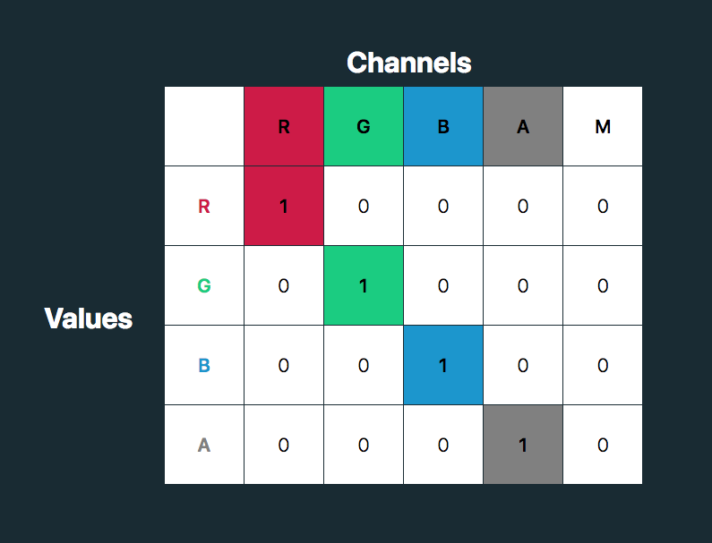
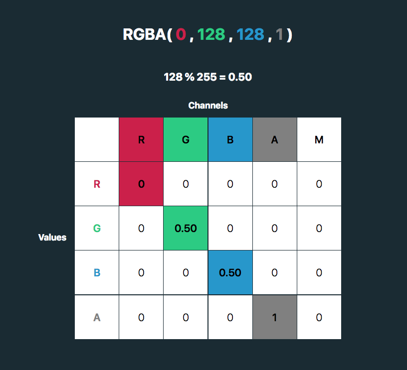
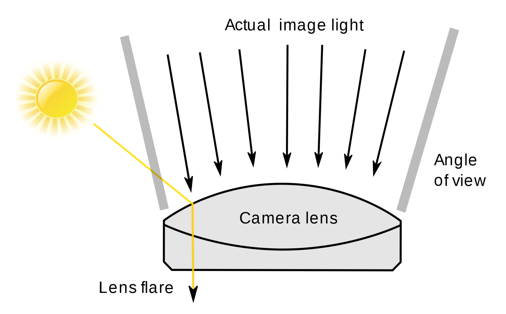
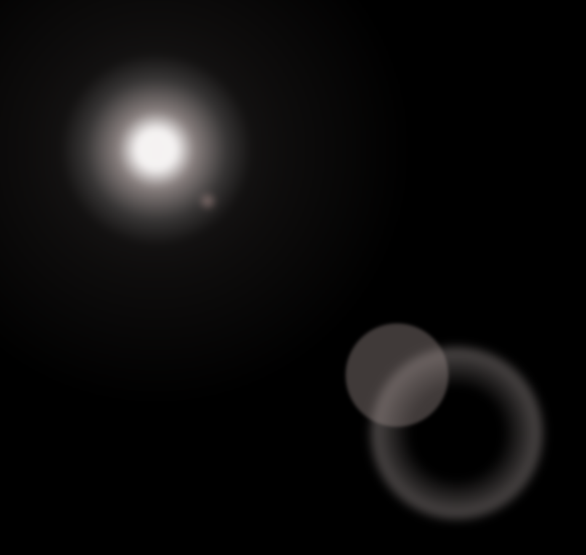

# css tricks

记录学习 https://css-tricks.com 一些技巧

- [css tricks](#css-tricks)
  - [1. Use FeColorMatrix to Change an SVG Fill](#1-use-fecolormatrix-to-change-an-svg-fill)
  - [2. Add a CSS Lens Flare to Photos for a Bright Touch](#2-add-a-css-lens-flare-to-photos-for-a-bright-touch)
  - [3. CSS Custom Highlight API: Range](#3-css-custom-highlight-api-range)
  - [4. Cool Hover Effects That Use Background Properties](#4-cool-hover-effects-that-use-background-properties)

## 1. Use FeColorMatrix to Change an SVG Fill

<filter> SVG 元素定义一个自定义分组过滤效果的原子滤波器。它本身不会呈现, 但必须使用的 filter SVG元素上的属性, 或filter SVG / HTML元素的CSS属性。

feColorMatrix 基于一个变换矩阵变化颜色。 https://developer.mozilla.org/en-US/docs/Web/SVG/Element/feColorMatrix  



前四列表示红色、绿色和蓝色的颜色和渠道α(不透明)值。行包含红、绿、蓝和α值在这些渠道。  
M列是一个乘数——我们不需要更改这些值, 每个颜色通道的值表示为浮点数在0到1之间。  

每个颜色通道的值(红、绿、蓝)被存储为整数范围在0到255。这是一个8位字节可以提供的范围。这些颜色通道值除以255,值可以表示为一个浮点数, 可以使用feColorMatrix。



```html
<style>
 .icon-img {
      filter: url("#colorFilter");
    }
</style>
<body>
  <svg id="svg" class="svg">
    <defs>
      <filter id="colorFilter">
        <feColorMatrix
          colorInterpolationFilters="sRGB"
          type="matrix"
          values="1.00 0   0   0   0
      0   0.54  0   0   0
      0   0   0  0   0
      0   0   0   1   0 "
        />
      </filter>
    </defs>
  </svg>
</body>
```

可实现对白色图标的颜色转换


demo代码：src/1-feColorMatrix  

参考资料：https://css-tricks.com/the-many-ways-to-change-an-svg-fill-on-hover-and-when-to-use-them/

## 2. Add a CSS Lens Flare to Photos for a Bright Touch



1. 中心光源发光的光球出现。  
2. 有一些横向椭圆光条纹——光线扭曲和模糊,导致长椭圆形。  
3. 中心随机拍摄光线从光源在不同的角度。

> radial-gradient  

创建了一个图像，该图像是由从原点发出的两种或者多种颜色之间的逐步过渡组成。它的形状可以是圆形（circle）或椭圆形（ellipse）。 

语法：radial-gradient(circle at center, red 0, blue, green 100%)  

> hsl

在 CSS 中，可以使用色相、饱和度和明度（HSL）来指定颜色，格式：hsla(hue, saturation, lightness)  

色相（hue）是色轮上从 0 到 360 的度数。0 是红色，120 是绿色，240 是蓝色。  

饱和度（saturation）是一个百分比值，0％ 表示灰色阴影，而 100％ 是全色。  

亮度（lightness）也是百分比，0％ 是黑色，50％ 是既不明也不暗，100％是白色。



模拟耀斑

```css
.lens-center {
    position: relative;
    width: 40vmin;
    height: 40vmin;
    border-radius: 100%;
    left: calc(35% - (40vmin / 2));
    top: calc(35% - (40vmin / 2));
    background: radial-gradient(closest-side circle at center,
        hsl(4 5% 100% / 100%) 0%, 
        hsl(4 5% 100% / 100%) 15%, 
        hsl(4 10% 70% / 70%) 30%,
        hsl(4 0% 50% / 30%) 55%,
        hsl(4 0% 10% / 5%) 75%,
        transparent 99%
    );
    filter: blur(4px);
}
.lens-center::before{
    content: '';
    display: block;
    width: 80vmin;
    height: 80vmin;
    left: calc((80vmin - 40vmin) / 2 * -1);
    top: calc((80vmin - 40vmin) /2 * -1);
    position: absolute;
    border-radius: 100%;
    background: radial-gradient(closest-side circle at center,
      hsl(4 15% 70% / 15%) 0%,
      transparent 100%);
}

.lens-center::after {
    content: '';
    display: block;
    width: 4vmin;
    height: 4vmin;
    left: 65%;
    bottom: 25%;
    position: absolute;
    border-radius: 100%;
    background: radial-gradient(closest-side circle at center,
        hsl(4 30% 70% / 60%) 0%,
        transparent 75%);
}

.circle-1 {
    width: calc(40vmin * 0.7);
    height: calc(40vmin * 0.7);
    left: 65%;
    top: 65%;
    border-radius: 100%;
    position: absolute;
    background: radial-gradient(closest-side circle at center,
        transparent 50%,
        hsl(4 10% 70% / 40%) 90%,
        transparent 100%);
    filter: blur(5px);
}

.circle-2 {
    width: calc(40vmin * 0.4);
    height: calc(40vmin * 0.4);
    left: 62%;
    top: 62%;
    border-radius: 100%;
    position: absolute;
    background:  hsl(4 10% 60% / 40%);
    filter: blur(2px);
}
```

demo代码：src/2-bright

参考资料：https://css-tricks.com/add-a-css-lens-flare-to-photos-for-a-bright-touch/

## 3. CSS Custom Highlight API: Range

[Range](https://developer.mozilla.org/zh-CN/docs/Web/API/Range)  表示一个包含节点与文本节点的一部分的文档片段。  

Range.setStart() 方法用于设置 Range的开始位置。  
Range.setEnd()方法用于设置 Range的结束位置。  

利用以上两个2个API获取选中的文档片段，然后对document.getSelection的文档设置高亮。

```js
setInterval(() => {
    if (index >= allWords.length) {
      index = 0;
    }
    const { word, parentNode, offset } = allWords[index];

    range.setStart(parentNode, offset);
    range.setEnd(parentNode, offset + word.length);
    document.getSelection().removeAllRanges();
    document.getSelection().addRange(range);

    index++;
  }, 100);
```


demo代码：src/3-highlight

参考资料：https://css-tricks.com/css-custom-highlight-api-early-loo/  
https://www.w3.org/TR/css-highlight-api-1/  

## 4. Cool Hover Effects That Use Background Properties


demo代码：src/4-background

参考资料：https://css-tricks.com/cool-hover-effects-using-background-properties/  