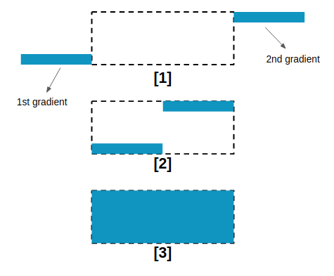

# css tricks

记录学习 https://css-tricks.com 一些技巧

- [css tricks](#css-tricks)
  - [1. Use FeColorMatrix to Change an SVG Fill](#1-use-fecolormatrix-to-change-an-svg-fill)
  - [2. Add a CSS Lens Flare to Photos for a Bright Touch](#2-add-a-css-lens-flare-to-photos-for-a-bright-touch)
  - [3. CSS Custom Highlight API: Range](#3-css-custom-highlight-api-range)
  - [4. Cool Hover Effects That Use Background Properties](#4-cool-hover-effects-that-use-background-properties)
  - [5. Scroll-Triggered-Animation](#5-scroll-triggered-animation)
  - [6. scrolltimeline](#6-scrolltimeline)
  - [7. clip-path](#7-clip-path)
  - [8. overscroll-behavior](#8-overscroll-behavior)
  - [9. grainy-gradients](#9-grainy-gradients)
  - [10. a-css-slinky-in-3d](#10-a-css-slinky-in-3d)
  - [11. spinner](#11-spinner)
  - [12. single-element-loaders-the-bars](#12-single-element-loaders-the-bars)
  - [13. loaders-going-3d](#13-loaders-going-3d)
  - [14. image-outline](#14-image-outline)
  - [15-border-image-source](#15-border-image-source)
  - [16-css-grid](#16-css-grid)
  - [17-scrollbar](#17-scrollbar)
  - [18-noise-gradient](#18-noise-gradient)
  - [19-mix-blend-mode](#19-mix-blend-mode)

## 1. Use FeColorMatrix to Change an SVG Fill

<filter> SVG 元素定义一个自定义分组过滤效果的原子滤波器。它本身不会呈现, 但必须使用的 filter SVG元素上的属性, 或filter SVG / HTML元素的CSS属性。

feColorMatrix 基于一个变换矩阵变化颜色。 https://developer.mozilla.org/en-US/docs/Web/SVG/Element/feColorMatrix  


前四列表示红色、绿色和蓝色的颜色和渠道α(不透明)值。行包含红、绿、蓝和α值在这些渠道。  
M列是一个乘数——我们不需要更改这些值, 每个颜色通道的值表示为浮点数在0到1之间。  

每个颜色通道的值(红、绿、蓝)被存储为整数范围在0到255。这是一个8位字节可以提供的范围。这些颜色通道值除以255,值可以表示为一个浮点数, 可以使用feColorMatrix。


```html
<style>
 .icon-img {
      filter: url("#colorFilter");
    }
</style>
<body>
  <svg id="svg" class="svg">
    <defs>
      <filter id="colorFilter">
        <feColorMatrix
          colorInterpolationFilters="sRGB"
          type="matrix"
          values="1.00 0   0   0   0
      0   0.54  0   0   0
      0   0   0  0   0
      0   0   0   1   0 "
        />
      </filter>
    </defs>
  </svg>
</body>
```

可实现对白色图标的颜色转换


demo代码：src/1-feColorMatrix  

参考资料：https://css-tricks.com/the-many-ways-to-change-an-svg-fill-on-hover-and-when-to-use-them/

## 2. Add a CSS Lens Flare to Photos for a Bright Touch


1. 中心光源发光的光球出现。  
2. 有一些横向椭圆光条纹——光线扭曲和模糊,导致长椭圆形。  
3. 中心随机拍摄光线从光源在不同的角度。

> radial-gradient  

创建了一个图像，该图像是由从原点发出的两种或者多种颜色之间的逐步过渡组成。它的形状可以是圆形（circle）或椭圆形（ellipse）。 

语法：radial-gradient(circle at center, red 0, blue, green 100%)  

> hsl

在 CSS 中，可以使用色相、饱和度和明度（HSL）来指定颜色，格式：hsla(hue, saturation, lightness)  

色相（hue）是色轮上从 0 到 360 的度数。0 是红色，120 是绿色，240 是蓝色。  

饱和度（saturation）是一个百分比值，0％ 表示灰色阴影，而 100％ 是全色。  

亮度（lightness）也是百分比，0％ 是黑色，50％ 是既不明也不暗，100％是白色。


模拟耀斑

```css
.lens-center {
    position: relative;
    width: 40vmin;
    height: 40vmin;
    border-radius: 100%;
    left: calc(35% - (40vmin / 2));
    top: calc(35% - (40vmin / 2));
    background: radial-gradient(closest-side circle at center,
        hsl(4 5% 100% / 100%) 0%, 
        hsl(4 5% 100% / 100%) 15%, 
        hsl(4 10% 70% / 70%) 30%,
        hsl(4 0% 50% / 30%) 55%,
        hsl(4 0% 10% / 5%) 75%,
        transparent 99%
    );
    filter: blur(4px);
}
.lens-center::before{
    content: '';
    display: block;
    width: 80vmin;
    height: 80vmin;
    left: calc((80vmin - 40vmin) / 2 * -1);
    top: calc((80vmin - 40vmin) /2 * -1);
    position: absolute;
    border-radius: 100%;
    background: radial-gradient(closest-side circle at center,
      hsl(4 15% 70% / 15%) 0%,
      transparent 100%);
}

.lens-center::after {
    content: '';
    display: block;
    width: 4vmin;
    height: 4vmin;
    left: 65%;
    bottom: 25%;
    position: absolute;
    border-radius: 100%;
    background: radial-gradient(closest-side circle at center,
        hsl(4 30% 70% / 60%) 0%,
        transparent 75%);
}

.circle-1 {
    width: calc(40vmin * 0.7);
    height: calc(40vmin * 0.7);
    left: 65%;
    top: 65%;
    border-radius: 100%;
    position: absolute;
    background: radial-gradient(closest-side circle at center,
        transparent 50%,
        hsl(4 10% 70% / 40%) 90%,
        transparent 100%);
    filter: blur(5px);
}

.circle-2 {
    width: calc(40vmin * 0.4);
    height: calc(40vmin * 0.4);
    left: 62%;
    top: 62%;
    border-radius: 100%;
    position: absolute;
    background:  hsl(4 10% 60% / 40%);
    filter: blur(2px);
}
```

demo代码：src/2-bright

参考资料：https://css-tricks.com/add-a-css-lens-flare-to-photos-for-a-bright-touch/

## 3. CSS Custom Highlight API: Range

[Range](https://developer.mozilla.org/zh-CN/docs/Web/API/Range)  表示一个包含节点与文本节点的一部分的文档片段。  

Range.setStart() 方法用于设置 Range的开始位置。  
Range.setEnd()方法用于设置 Range的结束位置。  

利用以上两个2个API获取选中的文档片段，然后对document.getSelection的文档设置高亮。

```js
setInterval(() => {
    if (index >= allWords.length) {
      index = 0;
    }
    const { word, parentNode, offset } = allWords[index];

    range.setStart(parentNode, offset);
    range.setEnd(parentNode, offset + word.length);
    document.getSelection().removeAllRanges();
    document.getSelection().addRange(range);

    index++;
  }, 100);
```


demo代码：src/3-highlight

参考资料：https://css-tricks.com/css-custom-highlight-api-early-loo/  
https://www.w3.org/TR/css-highlight-api-1/  

## 4. Cool Hover Effects That Use Background Properties

通过组合transforms, and transitions属性，设置background变量值，得到一些动画效果

> 效果1——左右渐变动画

```css
.hover-1 {
  background: linear-gradient(#1095c1 0 0) var(--p, 0) / var(--p, 0) no-repeat;
  transition: .4s, background-position 0s;
}
.hover-1:hover {
  --p: 100%;
  color: #fff;
}
```

> 效果2——上下渐变动画


```css
.hover-2 {
  background: linear-gradient(#1095c1 0 0) no-repeat
    calc(200% - var(--p, 0%)) 100% / 200% var(--p, 0.08em);
  transition: 0.3s var(--t, 0s),
    background-position 0.3s calc(0.3s - var(--t, 0s));
}
.hover-2:hover {
  --p: 100%;
  --t: 0.3s;
  color: #fff;
}
```

> 效果3——正方行渐变



```css
.hover-3 {
  --c: no-repeat linear-gradient(#1095c1 0 0);
  background: var(--c) calc(-101% + var(--p, 0%)) 100%,
    var(--c) calc(201% - var(--p, 0%)) 0;
  background-size: 50.1% var(--p, 0.08em);
  transition: 0.3s var(--t, 0s),
    background-position 0.3s calc(0.3s - var(--t, 0s));
}
.hover-3:hover {
  --p: 101%;
  --t: 0.3s;
  color: #fff;
}
```

> 效果4——菱形渐变


```css
.hover-4 {
  --c: #1095c1;
  line-height: 1.2em;
  background: conic-gradient(
        from -135deg at 100% 50%,
        var(--c) 90deg,
        #0000 0
      )
      0 var(--p, 0%),
    conic-gradient(from -135deg at 1.2em 50%, #0000 90deg, var(--c) 0) 100%
      var(--p, 0%);
  background-size: var(--s, 0%) 200%;
  background-repeat: no-repeat;
  transition: 0.4s ease-in, background-position 0s;
}
.hover-4:hover {
  --p: 100%;
  --s: calc(
    50% + 0.61em
  ); /* it should be 0.6em(1.2em/2) but we use a litte bigger */
  color: #fff;
}
```

demo代码：src/4-background

参考资料：https://css-tricks.com/cool-hover-effects-using-background-properties/  


## 5. Scroll-Triggered-Animation

scroll-triggered延迟加载图像或延迟加载评论部分。这样的话, 不会强迫用户下载元素没有在视窗初始页面加载。许多用户可能永远不会向下滚动,所以可以减少他们(和我们)带宽和加载时间。  

```js
function scrollTrigger(selector, options = {}) {
  let els = document.querySelectorAll(selector)
  els = Array.from(els)
  els.forEach(el => {
    addObserver(el, options)
  })
}
function addObserver(el, options) {
  // Check if `IntersectionObserver` is supported
  if(!('IntersectionObserver' in window)) {
    // Simple fallback
    // The animation/callback will be called immediately so
    // the scroll animation doesn't happen on unsupported browsers
    if(options.cb){
      options.cb(el)
    } else{
      entry.target.classList.add('active')
    }
    // We don't need to execute the rest of the code
    return
  }
  let observer = new IntersectionObserver((entries, observer) =>; {
    entries.forEach(entry => {
      if(entry.isIntersecting) {
        if(options.cb) {
          options.cb(el)
        } else{
          entry.target.classList.add('active')
        }
        observer.unobserve(entry.target)
      }
    })
  }, options)
  observer.observe(el)
}
// Example usages:
scrollTrigger('.intro-text')
scrollTrigger('.scroll-reveal', {
  rootMargin: '-200px',
})
scrollTrigger('.loader', {
  rootMargin: '-200px',
  cb: function(el){
    el.innerText = 'Loading...'
    setTimeout(() => {
      el.innerText = 'Task Complete!'
    }, 1000)
  }
})
```

demo代码：src/5-scroll-Triggered-Animation

参考资料：https://css-tricks.com/scroll-triggered-animation-vanilla-javascript/  

## 6. scrolltimeline

Animation：https://developer.mozilla.org/en-US/docs/Web/API/Animation
KeyframeEffect：https://developer.mozilla.org/en-US/docs/Web/API/KeyframeEffect/KeyframeEffect

```js
new Animation(
  new KeyframeEffect(
    document.querySelector(".progressbar"),
    {
      backgroundColor: ["red", "darkred"],
      transform: ["scaleX(0)", "scaleX(1)"],
    },
    {
      duration: 2500,
      fill: "forwards",
      easing: "linear",
    }
  )
).play();
```

demo代码：src/6-scrolltimeline  

参考资料：https://css-tricks.com/scroll-linked-animations-with-the-web-animations-api-waapi-and-scrolltimeline/  

## 7. clip-path

语法

```css
/* Keyword values */
clip-path: none;

/* <clip-source> values */
clip-path: url(resources.svg#c1);

/* <geometry-box> values */
clip-path: margin-box;
clip-path: border-box;
clip-path: padding-box;
clip-path: content-box;
clip-path: fill-box;
clip-path: stroke-box;
clip-path: view-box;

/* <basic-shape> values */
clip-path: inset(100px 50px);
clip-path: circle(50px at 0 100px);
clip-path: polygon(50% 0%, 100% 50%, 50% 100%, 0% 50%);
clip-path: path('M0.5,1 C0.5,1,0,0.7,0,0.3 A0.25,0.25,1,1,1,0.5,0.3 A0.25,0.25,1,1,1,1,0.3 C1,0.7,0.5,1,0.5,1 Z');

/* Box and shape values combined */
clip-path: padding-box circle(50px at 0 100px);

/* Global values */
clip-path: inherit;
clip-path: initial;
clip-path: unset;
```

demo代码：src/7-clip-path 

参考资料： https://css-tricks.com/exploring-the-css-paint-api-polygon-border/  
https://developer.mozilla.org/zh-CN/docs/Web/CSS/clip-path


## 8. overscroll-behavior

overscroll-behavior CSS 属性是 overscroll-behavior-x 和 overscroll-behavior-y 属性的合并写法, 让你可以控制浏览器过度滚动时的表现——也就是滚动到边界。  

```css
/* 关键字的值 */
overscroll-behavior: auto; /* 默认 */
overscroll-behavior: contain;
overscroll-behavior: none;

/* 使用2个值 */
overscroll-behavior: auto contain;

/* Global values */
overflow: inherit;
overflow: initial;
overflow: unset;
```

1. auto——默认效果
2. contain——设置这个值后，默认的滚动边界行为不变（“触底”效果或者刷新），但是临近的滚动区域不会被滚动链影响到，比如对话框后方的页面不会滚动。
3. none——临近滚动区域不受到滚动链影响，而且默认的滚动到边界的表现也被阻止。

demo代码：src/8-overscroll-behavior

参考资料：https://css-tricks.com/almanac/properties/o/overscroll-behavior/


## 9. grainy-gradients

[feTurbulence](https://developer.mozilla.org/zh-CN/docs/Web/SVG/Element/feTurbulence)该滤镜利用Perlin噪声函数创建了一个图像。它实现了人造纹理比如说云纹、大理石纹的合成。

```html
<svg viewBox="0 0 200 200" xmlns="http://www.w3.org/2000/svg">
  <filter id="noiseFilter">
    <feTurbulence
      type="fractalNoise"
      baseFrequency="0.65"
      numOctaves="3"
      stitchTiles="stitch"
    />
  </filter>

  <rect width="100%" height="100%" filter="url(#noiseFilter)" />
</svg>
```

[isolation](https://developer.mozilla.org/zh-CN/docs/Web/CSS/isolation)属性定义该元素是否必须创建一个新的层叠上下文,该属性的主要作用是当和background-blend-mode属性一起使用时，可以只混合一个指定元素栈的背景：它允许使一组元素从它们后面的背景中独立出来，只混合这组元素的背景。

```css
.isolate {
  isolation: isolate;
  position: absolute;
  top: 0;
  height: 100%;
  width: 100%;
}

.ball-shadow {
  height: 100%;
  background: radial-gradient(
      circle at 65% 35%,
      rgba(0, 0, 0, 0),
      mediumblue
    ),
    url(https://grainy-gradients.vercel.app/noise.svg);
  filter: contrast(120%) brightness(900%);
}

.ball-light {
  position: absolute;
  top: 0;
  width: 100%;
  height: 100%;
  background: radial-gradient(circle at 67% 30%, lightsalmon, crimson);
  mix-blend-mode: multiply;
}
```

demo代码：src/9-grainy-gradients

参考资料：https://css-tricks.com/grainy-gradients/  
https://developer.mozilla.org/zh-CN/docs/Web/SVG/Element/feTurbulence  

## 10. a-css-slinky-in-3d


translate3d() CSS 函数在3D空间内移动一个元素的位置。这个移动由一个三维向量来表达，分别表示他在三个方向上移动的距离。

```text
translate3d(tx, ty, tz)
```

tx是一个 <length> 代表移动向量的横坐标。  
ty是一个<length> 代表移动向量的纵坐标。  
tz是一个 <length> 代表移动向量的z坐标  

demo代码：src/10-a-css-slinky-in-3d

参考资料：https://css-tricks.com/a-css-slinky-in-3d/  
https://codepen.io/jh3y/pen/WNXBdyZ  

## 11. spinner


demo代码：src/11-spinner

参考资料：https://css-tricks.com/single-element-loaders-the-spinner/

## 12. single-element-loaders-the-bars


demo代码：src/12-loaders-the-bars

参考资料：https://css-tricks.com/single-element-loaders-the-bars/


## 13. loaders-going-3d


demo代码：src/13-loaders-going-3d

参考资料：https://css-tricks.com/single-element-loaders-going-3d/


## 14. image-outline

`outline` 设置多个轮廓属性的简写属性。

outline = 
  <'outline-color'>  ||
  <'outline-style'>  ||
  <'outline-width'>  


```css
/* 样式 */
outline: solid;

/* 颜色 | 样式 */
outline: #f66 dashed;

/* 样式 | 宽度 */
outline: inset thick;

/* 颜色 | 样式 | 宽度 */
outline: green solid 3px;

/* 全局值 */
outline: inherit;
outline: initial;
outline: unset;
```

border 和 outline 区别：

1. outline 不占据空间，绘制于元素内容周围。
2. 根据规范，outline 通常是矩形，但也可以是非矩形的。

`mask`通过遮罩或者裁切特定区域的图片的方式来隐藏一个元素的部分或者全部可见区域。

 mask 的简写会将 mask-border 设为初始值。使用 mask 的简写优于使用其他简写或者各自属性的设置来覆盖。这能保证 mask-border 也会重新设置为新的效果样式。

```text
mask = 
  <mask-layer>#  

<mask-layer> = 
  <mask-reference>              ||
  <position> [ / <bg-size> ]?   ||
  <repeat-style>                ||
  <geometry-box>                ||
  [ <geometry-box> | no-clip ]  ||
  <compositing-operator>        ||
  <masking-mode>                

<mask-reference> = 
  none           |
  <image>        |
  <mask-source>  

<position> = 
  [ left | center | right | top | bottom | start | end | <length-percentage> ]  |
  [ left | center | right | x-start | x-end | <length-percentage> ] [ top | center | bottom | y-start | y-end | <length-percentage> ]  |
  [ center | [ left | right | x-start | x-end ] <length-percentage>? ] && [ center | [ top | bottom | y-start | y-end ] <length-percentage>? ]  |
  [ center | [ start | end ] <length-percentage>? ] [ center | [ start | end ] <length-percentage>? ]  

<bg-size> = 
  [ <length-percentage [0,∞]> | auto ]{1,2}  |
  cover                                      |
  contain                                    

<repeat-style> = 
  repeat-x                                     |
  repeat-y                                     |
  [ repeat | space | round | no-repeat ]{1,2}  

<geometry-box> = 
  <shape-box>  |
  fill-box     |
  stroke-box   |
  view-box     

<compositing-operator> = 
  add        |
  subtract   |
  intersect  |
  exclude    

<masking-mode> = 
  alpha         |
  luminance     |
  match-source  

<image> = 
  <url>       |
  <gradient>  

<mask-source> = 
  <url>  

<length-percentage> = 
  <length>      |
  <percentage>  

<shape-box> = 
  <box>       |
  margin-box  

<box> = 
  border-box   |
  padding-box  |
  content-box  

```

demo代码：src/14-image-outline

## 15-border-image-source

border-image-source 用于声明元素的边框图片（border-image）的资源。

> 语法

```text
/* no border-image, use the specified border-style */
border-image-source: none;

/* the image.jpg is used as image */
border-image-source: url(image.jpg);

/* a gradient is used as image */
border-image-source: linear-gradient(to top, red, yellow);

/* Global values */
border-image-source: inherit;
border-image-source: initial;
border-image-source: unset;
```

demo代码：src/15-border-image-source

参考资料：https://css-tricks.com/almanac/properties/b/border-image-source/  
https://developer.mozilla.org/en-US/docs/Web/CSS/border-image-source  

## 16-css-grid


demo代码：src/16-css-grid

参考资料：https://css-tricks.com/css-grid-and-custom-shapes-part-3/


## 17-scrollbar

::-webkit-scrollbar CSS 伪类元素会影响设置了 overflow:scroll; 的元素的滚动条样式。

可以使用以下伪元素选择器去修改基于 webkit 的浏览器的滚动条样式：

- ::-webkit-scrollbar——整个滚动条。
- ::-webkit-scrollbar-button——滚动条上的按钮（上下箭头）。
- ::-webkit-scrollbar-thumb——滚动条上的滚动滑块。
- ::-webkit-scrollbar-track——滚动条轨道。
- ::-webkit-scrollbar-track-piece——滚动条没有滑块的轨道部分。
- ::-webkit-scrollbar-corner——当同时有垂直滚动条和水平滚动条时交汇的部分。通常是浏览器窗口的右下角。
- ::-webkit-resizer——出现在某些元素底角的可拖动调整大小的滑块。

demo代码：src/17-scrollbar

参考资料：https://css-tricks.com/classy-and-cool-custom-css-scrollbars-a-showcase/


## 18-noise-gradient


demo代码：src/18-scrollbar

参考资料：https://css-tricks.com/making-static-noise-from-a-weird-css-gradient-bug/

## 19-mix-blend-mode

mix-blend-mode: https://developer.mozilla.org/zh-CN/docs/Web/CSS/mix-blend-mode

| Photoshop图层 | CSS混合模式 | 中文名称 | 功能描述 |
| ------------ | ---------- | -------- | -------- |
| normal	| normal | 正常模式	| 混合色的像素会透过所用的颜色显示出来| 
| multiply	| multiply	| 正片叠底模式	| 在“正片叠底”模式中，查看每个通道中的颜色信息，并将“基色”与“混合色”复合。| 
| screen	| screen	| 滤色模式	| “滤色”模式与“正片叠底”模式正好相反，它将图像的“基色”颜色与“混合色”颜色结合起来产生比两种颜色都浅的第三种颜色| 
| overlay	| overlay	| 叠加模式	| “叠加”模式把图像的“基色”颜色与“混合色”颜色相混合产生一种中间色。| 
| darken	| darken	| 变暗模式	| 在“变暗”模式中，查看每个通道中的颜色信息，并选择“基色”或“混合色”中较暗的颜色作为“结果色”。| 
| lighten	l| ighten	| 变亮模式	| 在“变亮”模式中，查看每个通道中的颜色信息，并选择“基色”或“混合色”中较亮的颜色作为“结果色”。| 
| color-dodge	| color-dodge	| 颜色减淡模式	| 在“颜色减淡”模式中，查看每个通道中的颜色信息，并通过减小对比度使基色变亮以反映混合色。与黑色混合则不发生变化。| 
| color-burn	| color-burn	| 颜色加深模式	| 在“颜色加深”模式中，查看每个通道中的颜色信息，并通过增加对比度使基色变暗以反映混合色，如果与白色混合的话将不会产生变化。| 
| hard-light	| hard-light| 	强光模式	| “强光”模式将产生一种强光照射的效果。如果“混合色”颜色“基色”颜色的像素更亮一些，那么“结果色”颜色将更亮；如果“混合色”颜色比“基色”颜色的像素更暗一些，那么“结果色”将更暗。| 
| soft-light	| soft-light	| 柔光模式	| 柔光”模式会产生一种柔光照射的效果。如果“混合色”颜色比“基色颜色的像素更亮一些，那么“结果色”将更亮；如果“混合色”颜色比“基色”颜色的像素更暗一些，那么“结果色”颜色将更暗，使图像的亮度反差增大。| 
| difference	| difference	| 差值模式	| 在“差值”模式中，查看每个通道中的颜色信息，“差值”模式是将从图像中“基色”颜色的亮度值减去“混合色”颜色的亮度值，如果结果为负，则取正值，产生反相效果。| 
| exclusion	| exclusion	| 排除模式	| “排除”模式与“差值”模式相似，但是具有高对比度和低饱和度的特点。比用“差值”模式获得的颜色要柔和、更明亮一些。| 
| hue	| hue	| 色相模式	| “色相”模式只用“混合色”颜色的色相值进行着色，而使饱和度和亮度值保持不变。| 
| saturation	| saturation	| 饱和度模式	| “饱和度”模式的作用方式与“色相”模式相似，它只用“混合色”颜色的饱和度值进行着色，而使色相值和亮度值保持不变。| 
| color	| color	| 颜色模式	“| 颜色”模式能够使用“混合色”颜色的饱和度值和色相值同时进行着色，而使“基色”颜色的亮度值保持不变。“颜色”模式模式可以看成是“饱合度”模式和“色相”模式的综合效果。| 
| luminosity	| luminosity	| 亮度模式	| “亮度”模式能够使用“混合色”颜色的亮度值进行着色，而保持“基色”颜色的饱和度和色相数值不变。其实就是用“基色”中的“色相”和“饱和度”以及“混合色”的亮度创建“结果色”。| 

分为几个大类：

| 分类名称	|  混合模式名称	| 描述 | 
| ---------- | -------- | -------- |
| 基础混合模式	| normal	| 利用图层透明度和不透明度来控制与下面的图层混合| 
| 降暗混合模式	| darken,multiply,color-burn	| 减色模式，滤掉图像中高亮色，从而达到图像变暗| 
| 加亮混合模式	| screen,lighten,color-dodge	| 加色模式，滤掉图像中暗色，从而达到图像变亮| 
| 融合混合模式	| overlay,soft-light,hard-light	| 用于不同程度的对上、下两图层的融合| 
| 变异混合模式	| difference,exclusion,hard-light	| 用于制作各种变异的图层混合| 
| 色彩叠加混合模式	| hue,saturation,color,luminosity	| 根据图层的色相，饱和度等基本属性，完成图层融合| 


demo代码：19-mix-blend-mode

参考资料：https://csscoco.com/inspiration/#/./blendmode/mixblend-text-wave-effect  
https://csscoco.com/inspiration/#/./blendmode/mix-blend-mode-text-adapt-background  


